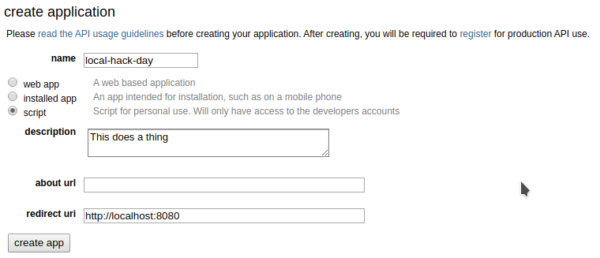
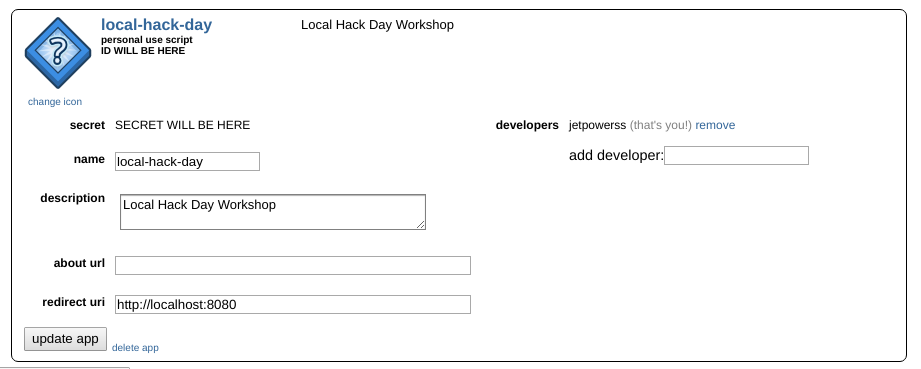

# Reddit API Setup

## Step 1: Make a Reddit account

## Step 2: Create an application

1. Go to [app preferences](https://www.reddit.com/prefs/apps)
2. Press `Create Application`
3. Fill in the application like the screenshot below.
4. Copy the ID and Secret into `config.json`

